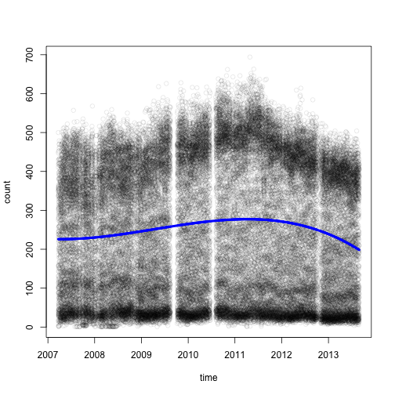
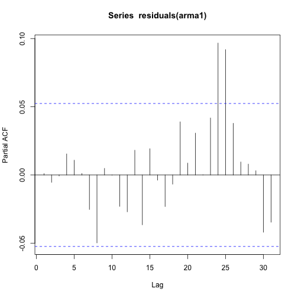

# Santa Rosa

Fastrak is the California highway toll system.
The cars that drive through the toll have been counted.
We've downloaded the data for hourly counts from each Fastrak stations for
the past 7 years. There are about 8 million rows.
We examine the time series for station 4300, Santa Rosa, because it is
among the most consistent.
to be more consistent than the others.


```r
# To produce the report
library(knitr)

# Box cox transformation
library(MASS)

# semitransparent plotting with alpha
library(scales)

# tested helper functions
source('../functions.R')

# contains the `fastrak` data frame with 8 million rows
load('../fastrak.Rda')
```

## Preparation

Significant time was spent preparing this data. 
There were three major issues:

- Missing data
- Too many zeros 
- A month long period where the traffic was double what it should have been
  across all stations

Since we have plenty of data we dropped all of these suspicious points. 
It would be certainly be possible to interpolate or backcast to fill in the
missing data as well.

We dealt with this by writing a small library of tested functions to
prepare the data in a disciplined, repeatable way.

Here is the data of interest.


```r
sr1 = getstation(4300, fastrak)

kable(head(sr1))
```


|    |time                |station | count|year |month |weekday |hour |
|:---|:-------------------|:-------|-----:|:----|:-----|:-------|:----|
|25  |2007-03-23 03:00:00 |4300    |    32|2007 |March |Friday  |03   |
|170 |2007-03-23 04:00:00 |4300    |    35|2007 |March |Friday  |04   |
|315 |2007-03-23 05:00:00 |4300    |   103|2007 |March |Friday  |05   |
|460 |2007-03-23 06:00:00 |4300    |   231|2007 |March |Friday  |06   |
|605 |2007-03-23 07:00:00 |4300    |   357|2007 |March |Friday  |07   |
|750 |2007-03-23 08:00:00 |4300    |   411|2007 |March |Friday  |08   |

## Trend and Seasonality

We used a general linear model in two ways. First we identified outlying points
where the sensor was only partially active and excluded these questionable
points from further analysis. Second we estimate 
the trend and seasonality.


```r
with(sr1, plot(time, count, col=alpha('black', 0.1)))

fit0 = lm(count ~ poly(time, 3), sr1)
lines(sr1$time, predict(fit0), lwd=4, col='blue')
```

 

This plot indicates that a
cubic polynomial adequately approximates the shape of the long term trend. 
This is preferable to a fit based on the categorical
variable year since the cubic polynomial is smooth and therefore will not
contribute any discontinuities to the time series.

Experience tells us that traffic varies primarily according to time of 
day, and also by the day of the week. Moreover, hourly patterns are
different on different days of the week. It's also possible that there are
annual trends.

The above observations suggest the following general linear model:

$$
    count = time + time^2 + time^3 + month + weekday + hour + weekday:hour + \epsilon
$$

Here $time$ is continuous and all other predictor variables are categorical.
$weekday$ and $hour$ are the main effects for day of the week and hour.
$weekday:hour$ is the interaction term between weekday and hour.
$month$ accounts for any annual seasonal trends.
Note that the polynomial time terms are actually orthogonal polynomials, as is the
default in R's `poly` function. For convenience we express them in this form.

Let $Y_t = count$, $m_t = time + time^2 + time^3$, $s_t = month + weekday +
hour + weekday:hour$, and $X_t = \epsilon$. Then we may express the model
as:

$$
    Y_t = m_t + s_t + X_t
$$

We see that the model can be understood in terms of the classic
linear time series decomposition. The major difference is in the complexity
of the seasonal component. This model accounts for seasonality at three levels: month,
weekday, and hour. Our time series analysis is then on the residual series $(X_t)$.

### Variance stabilizing transform

The box cox method indicated using the cube root function on the counts as
a variance stabilizing transformation.


```r
boxcox(lm(count ~ hour + weekday + hour:weekday + month + poly(time, 3), sr1))
```

 

```r
# Model formula for subsequent use
f = count^(1/3) ~  hour + weekday + hour:weekday + month + poly(time, 3)
```

### Outlier detection and removal

The initial fit of the linear model identified suspicious data points where the sensor may
have stopped working.


```r
fit1 = lm(f, sr1)
res1 = residuals(fit1)
plot(sr1$time, res1, col=alpha('black', 0.1))
```

 

Before removing the bottom 1% of residuals we see excessively many large
negative residuals.
For symmetry we used this same threshold on the top of the residuals as well.


```r
cutoff = quantile(res1, 0.01)
cutoff
```

```
##        1% 
## -1.709734
```

```r
sr2 = sr1[(res1 > cutoff) & (res1 < -cutoff), ]
dim(sr2)
```

```
## [1] 49390     7
```

This operation cut about 500 points from the bottom and 5 from the top.

These are the residuals after trimming outliers:


```r
fit2 = lm(f, sr2)
```


```r
sr2$res = residuals(fit2)
with(sr2, plot(time, res, col=alpha('black', 0.2)))
```

 

We still observe the same effect, but it's not as bad. 

### Interpretation

Inspecting the corresponding ANOVA table tells us much about the relative
sources of variation in the count data.


```r
summary(fit2)$adj.r.squared
```

```
## [1] 0.9720136
```

```r
a2 = anova(fit2)
a2$percent = 100 * a2[, 'Sum Sq'] / sum(a2[, 'Sum Sq'])
kable(a2)
```


|              |    Df|      Sum Sq|    Mean Sq|    F value| Pr(>F)|    percent|
|:-------------|-----:|-----------:|----------:|----------:|------:|----------:|
|hour          |    23| 140140.3886| 6093.06037| 68109.3102|      0| 88.7670198|
|weekday       |     6|   5972.1541|  995.35901| 11126.2997|      0|  3.7828518|
|month         |    11|    217.7513|   19.79558|   221.2785|      0|  0.1379270|
|poly(time, 3) |     3|   1539.9660|  513.32199|  5738.0043|      0|  0.9754375|
|hour:weekday  |   138|   5601.9786|   40.59405|   453.7675|      0|  3.5483771|
|Residuals     | 49208|   4402.1488|    0.08946|         NA|     NA|  2.7883869|

The adjusted $R^2$ value is 0.97, so this model explains 97% of the
variation in the cube root of counts.

Consider the relative magnitudes of the effects.
We observe that $hour$ alone accounts for 89% of the variation, while the
long term trend due to time explains only 1% after the seasonal variables are
in the model.

The annual seasonal effect of $month$ is tiny, accounting for just 0.14% of
variation after $hour$ and $week$ are included. This means that traffic is relatively constant throughout the
year.

Possible questions: When should engineers plan construction around this
sensor to cause the smallest disruption to traffic?
From the above insights we conclude that the time of the day matters most, 
and that any time in the year is fine.

Interesting side note- the p values presented in the ANOVA table are
misleading. 
We can add a random noise term, and it still has a 
p value that's numerically 0. But the relative magnitude of the
corresponding sum of squares is insignificant.


```r
sr2$noise = as.factor(sample(1:12, size=nrow(sr2), replace=TRUE))
f2 = count^(1/3) ~ noise + hour + weekday + hour:weekday + poly(time, 3)
anova(lm(f2, sr2))
```

```
## Analysis of Variance Table
## 
## Response: count^(1/3)
##                  Df Sum Sq Mean Sq   F value    Pr(>F)    
## noise            11     24     2.1    22.154 < 2.2e-16 ***
## hour             23 140119  6092.1 62871.031 < 2.2e-16 ***
## weekday           6   5973   995.6 10274.195 < 2.2e-16 ***
## poly(time, 3)     3   1385   461.5  4763.128 < 2.2e-16 ***
## hour:weekday    138   5606    40.6   419.208 < 2.2e-16 ***
## Residuals     49208   4768     0.1                        
## ---
## Signif. codes:  0 '***' 0.001 '**' 0.01 '*' 0.05 '.' 0.1 ' ' 1
```

## Finding consecutive runs

After this preparation we were ready to pick out the time series.
We did this by finding all runs of consecutively spaced residuals that were
longer than 1000 on the filtered data. There are 5 such groups.


```r
diffsr = diff(sr2$time)
islong = longrun(diffsr, 1, 1000)
long = rle(islong)

sr3 = sr2[islong, ]

# TODO - this should be it's own tested function - this code is a bit
# too hacky

# Infer the time spaced groups
a = rle(as.numeric(diff(sr3$time)))
a$values = 1:((length(a$values) + 1) / 2)
a$lengths = 1 + a$lengths[a$lengths != 1]
sr3$group = inverse.rle(a)

# We can add the fitted values in for further analysis
# Exponentiating since we fitted the cube root
sr3$fitted = predict(fit2, sr3) ** 3

dim(sr3)
```

```
## [1] 6228   11
```

```r
with(sr3, plot(time, res, col=alpha('black', 0.2)))
```

 

```r
save(sr3, file='cleaned.Rda')
```

## Common sense check

We'll first focus on the third
group. For ease of further analysis we'll center and scale the data, and
call the resulting vector $X$.


```r
sr33 = sr3[sr3$group == 3, ]
sr33$X = scale(sr33$res)
X = sr33$X

with(sr33, plot(time, X))
```

 

Let's make sure that the fitting worked using a week's worth of data.


```r
small = 600:750
with(sr33[small, ], plot(time, count, lwd=1.5, type='l'))
with(sr33[small, ], lines(time, fitted, lty=2, col='red'))
```

 

The fitted values look as expected.

Here are the corresponding residuals.


```r
with(sr33[small, ], plot(time, X, type='l'))
```

 

## Time Series

We now can begin the time series analysis. 


```r
acf(X)
```

 

```r
pacf(X)
```

 

We'll search over a grid to find the best ARMA model as determined by AIC.


```r
# Parameters to search over:
#ap = expand.grid(ar=3:6, ma=3:6)
ap = expand.grid(ar=1:3, ma=1:3)
getaic = function(ar, ma, x=X){
    arima(x, order=c(ar, 0, ma), optim.control=list(maxit=1000))$aic
}
aicvals = mapply(getaic, ap$ar, ap$ma)
plot(aicvals)
```

 

Note- we needed to extend the maximum number of iterations in order to
compute accurate AIC values for the larger models.
Surprising how fast this becomes computationally expensive.


```r
ap[which.min(aicvals), ]
```

```
##   ar ma
## 9  3  3
```

```r
arma1 = arima(X, order=c(6, 0, 6), optim.control=list(maxit=1000))
arma1$aic
```

```
## [1] 3776.976
```

The AIC criteria chooses an ARMA(6, 6) model.

Check if the residuals resemble white noise.


```r
acf(residuals(arma1))
```

 

```r
pacf(residuals(arma1))
```

 

We still see spikes at 24. These make sense because they represent the
following day. Let's compare this with a larger AR model.


```r
ar1 = ar(X, method='yw', order.max=35)
ar1$order
```

```
## [1] 32
```

Yule-Walker is the default.
We'll bump the maximum order from 31 up to 35.

The AR model chose an AR(32) model based on AIC. Let's see how these
residuals look.


```r
r1 = na.omit(ar1$resid)
acf(r1)
```

 

```r
pacf(r1)
```

 

They look more like white noise than the ARMA(6, 6) model.
I wonder if the fit looks any different with
other algorithms? The default uses Yule-Walker, but there's also MLE and
OLS to try.


```r
ar2 = ar(X, order.max=35, method='ols', intercept=FALSE)
ar2$order
```

```
## [1] 32
```

```r
r2 = na.omit(ar2$resid)
acf(r2)
```

 

```r
pacf(r2)
```

 

We don't need to fit an intercept because the data is centered.

So OLS chose an AR(32) model. 


```r
ar3 = ar(X, order.max=35, method='burg', intercept=FALSE)
ar3$order
```

```
## [1] 32
```

```r
r3 = na.omit(ar3$resid)
acf(r3)
```

 

```r
pacf(r3)
```

 

Surprising that the coefficients are all different. For example, we look at
the first three:


```r
first4 = data.frame('yule-walker'=ar1$ar[1:4], 'ols'=ar2$ar[1:4],
           'burg'=ar3$ar[1:4])
first4
```

```
##   yule.walker         ols        burg
## 1 0.260738636 0.271636613 0.258953862
## 2 0.085682152 0.072707064 0.085358004
## 3 0.055885363 0.055592143 0.056362762
## 4 0.005726957 0.008108437 0.006372378
```

## Prediction

An hour ahead, a day ahead, or a week ahead.

The adjusted $R^2$ for the ANOVA model is 0.972. We also observe that the
residuals from this model do not exhibit any trend or seasonality.

We conclude that the
ANOVA fit adequately explains the smooth component.


```r
s = summary(fit2)
s$adj.r.squared
```

```
## [1] 0.9720136
```

```r
kable(anova(fit2))
```


|              |    Df|      Sum Sq|    Mean Sq|    F value| Pr(>F)|
|:-------------|-----:|-----------:|----------:|----------:|------:|
|hour          |    23| 140140.3886| 6093.06037| 68109.3102|      0|
|weekday       |     6|   5972.1541|  995.35901| 11126.2997|      0|
|month         |    11|    217.7513|   19.79558|   221.2785|      0|
|poly(time, 3) |     3|   1539.9660|  513.32199|  5738.0043|      0|
|hour:weekday  |   138|   5601.9786|   40.59405|   453.7675|      0|
|Residuals     | 49208|   4402.1488|    0.08946|         NA|     NA|

To evaluate the performance on the rough part we'll use a fit on the first
1300 data points in the series to predict the remaining 99.


```r
ar1300 = ar(X[1:1300], order.max=35)
```

We predict the next 99.


```r
preds = predict(ar1300, n.ahead=99)$pred
plot(preds)
```

 

Lets examine the first 10 predictions compared with the actual values.


```r
d = sr33$time[1301:1399]
plot(d, X[1301:1399], type='l')
lines(d, preds, col='blue')
```

 

# Computing

The initial size of this data set, 8 million points, presented some unique
computational challenges. 

We used R's biglm package together with 
chunking to fit a linear ANOVA model with 5000 rows. It took 5 days to run on the
department server (gumbel). Additionally, it used all 256 GB of memory 
available.
It's possible that different chunk sizes would have performed
better. `lme4` solves the problem with sparse matrices, which is 
ideal, but it wouldn't fit the full model, even with the 256 GB of
memory on the server.
