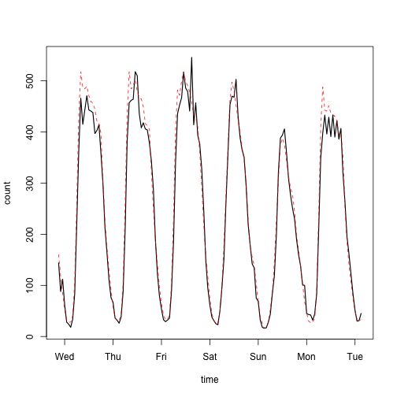

# Santa Rosa

Fastrak is the California highway toll system.
The cars that drive through the toll have been counted.
We've downloaded the data for hourly counts from each Fastrak stations for
the past 7 years. There are about 8 million rows.
We examine the time series for station 4300, Santa Rosa, because it looks
to be more consistent than the others.


```r
# To produce the report
library(knitr)

# semitransparent plotting with alpha
library(scales)

# ANOVA model
library(lme4)

# tested helper functions
source('../functions.R')

# contains the `fastrak` data frame with 8 million rows
load('../fastrak.Rda')
```

## Preparation

Here is the data of interest.


```r
sr1 = getstation(4300, fastrak)

kable(head(sr1))
```


|    |time                |station | count|year |month |weekday |hour |  residuals|
|:---|:-------------------|:-------|-----:|:----|:-----|:-------|:----|----------:|
|25  |2007-03-23 03:00:00 |4300    |    32|2007 |March |Friday  |03   | -2.4031615|
|170 |2007-03-23 04:00:00 |4300    |    35|2007 |March |Friday  |04   | -2.9898080|
|315 |2007-03-23 05:00:00 |4300    |   103|2007 |March |Friday  |05   | -1.5040558|
|460 |2007-03-23 06:00:00 |4300    |   231|2007 |March |Friday  |06   | -0.7732094|
|605 |2007-03-23 07:00:00 |4300    |   357|2007 |March |Friday  |07   | -0.8023823|
|750 |2007-03-23 08:00:00 |4300    |   411|2007 |March |Friday  |08   | -1.5260884|

```r
with(sr1, plot(time, count, col=alpha('black', 0.1)))
```

 

We observe a couple problems. In the 150 stations all the data shows the 
pattern of having nearly double the count in July of 2010. Additionally we
have missing data encoded as 0's.

3 or more zeros means that the no cars drove by for at least a 3 hour 
period. This is extremely unlikely if the toll was operational.

We can fix this by identifying the runs of 3 or more zeros and changing the
corresponding counts to NA. When we did this we saw huge negative
residuals when models were fitted. The more conservative thing to do is
transform all the zeros to NA.


```r
sr1$count[sr1$count == 0] = NA
```


```r
# Didn't really work:
## Before:
#sum(is.na(sr1$count))
#
## Using custom function
#zr1 = zerorun(sr1$count, 3)
#
#sr1$count[zr1] = NA
#
## After:
#sum(is.na(sr1$count))
```

So this eliminates about 4000 points.

Now we'll visually identify where the abnormally large period in July 2010
begins and ends, and then code it as NA.


```r
a = as.POSIXct('2010-06-10')
b = as.POSIXct('2010-08-20')
ab = (a < sr1$time) & (sr1$time < b)
with(sr1[ab, ], plot(time, count, col=alpha('black', 0.5)))

# Lines marking the cutoff dates
startbig = as.POSIXct('2010-06-23')
endbig = as.POSIXct('2010-08-04')
abline(v=c(startbig, endbig), lwd=2)
```

 

```r
# Transform to NA's
toobig = (startbig < sr1$time) & (sr1$time < endbig)
sr1$time[toobig] = NA
```

Let's inspect the data to see the effect of the cleaning.


```r
with(sr1, plot(time, count, col=alpha('black', 0.1)))
```

 

This looks much more reasonable.

How much of the data is now missing?


```r
sum(is.na(sr1$count) / length(sr1$count))
```

```
## [1] 0.07617854
```

About 7.2 percent. We also know that these missing values come in long
runs. Exactly how large are the largest runs?


```r
narun = rle(is.na(sr1$count))
max(narun$length[!narun$values])
```

```
## [1] 3885
```

So we have a run of nearly 4000. We can work with that. We also need to
make sure that the hourly observations are complete. Let's visualize to see
where these are.


## Trend and Seasonality

Now that the suspicious data has been recoded to NA we are in a position to
remove the trend and seasonality. We'll do it through estimation of the
mean using the following ANOVA model:

$$
    \sqrt(count) = year + month + weekday + hour + weekday:hour + \epsilon
$$

This removes yearly trend and seasonality at 3 levels: month, weekday, and
hour.


```r
fit1 = lm(sqrt(count) ~ year + month + weekday*hour, sr1)
kable(anova(fit1))
```


|             |    Df|     Sum Sq|      Mean Sq|    F value| Pr(>F)|
|:------------|-----:|----------:|------------:|----------:|------:|
|year         |     6|   32406.22|  5401.036233|  1815.7114|      0|
|month        |    11|   10716.11|   974.191986|   327.5022|      0|
|weekday      |     6|   78694.98| 13115.829871|  4409.2579|      0|
|hour         |    23| 1731382.49| 75277.499725| 25306.6647|      0|
|weekday:hour |   138|   71755.89|   519.970207|   174.8027|      0|
|Residuals    | 50688|  150777.12|     2.974612|         NA|     NA|

```r
sr1$predicted = predict(fit1, sr1)
sr1$residuals = sqrt(sr1$count) - sr1$predicted
```

Take a look at the residuals.


```r
a = as.POSIXct('2011-03-10')
b = as.POSIXct('2011-03-30')
ab = (a < sr1$time) & (sr1$time < b)
with(sr1[ab, ], plot(time, residuals, type='l'))
```

 

We get some huge negative numbers. I'll bet that's because March 17th had a
zero for an NA value which was not removed. So we probably need to remove
all the zeros!

Still see a bunch of unusually low values when all zeros are removed. My
suspicion is that the sensor stopped working for a short period of time.
Then picked back up again. So what we actually need to do is code as NA all
those points that are on the border of the zeros as well. Because the
sensor wasn't totally functioning at that hour.


```r
with(sr1, plot(time, residuals, col=alpha('black', 0.1)))
abline(h=0, col='yellow', lwd=2)
```

 

Looks like icicles hanging off the data centered around 0.

Let's see if we get anything reasonable from the ACF. The data isn't
exactly equi-spaced, but it's not too far off either.


```r
acf(sr1$residuals[(sr1$year == 2011) & !(is.na(sr1$residuals))])
```

 

```r
pacf(sr1$residuals[(sr1$year == 2011) & !(is.na(sr1$residuals))])
```

 

Looks like there's lots here for further analysis.
